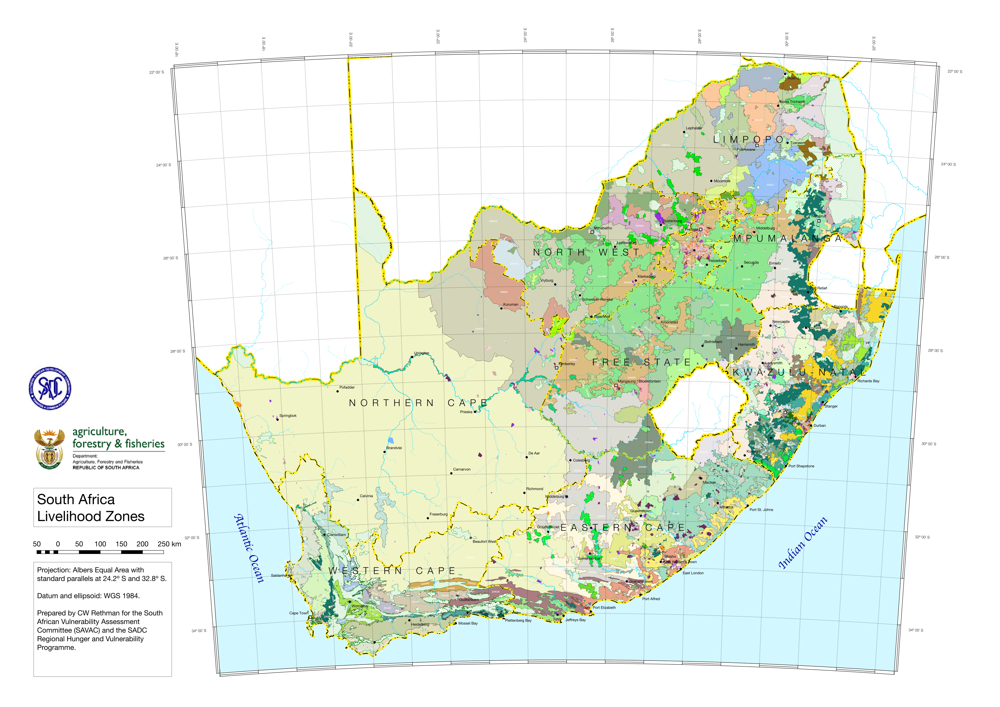

# create-grids-frames

## Intro

Ever wondered how you could create a really cool map layout in QGIS, where the map's edges are defined by a set of longitudinal and latitudinal lines, regardless of the projection used. Then, for example, a conical-projected map would look like this:

Looks cool, doesn't it?
